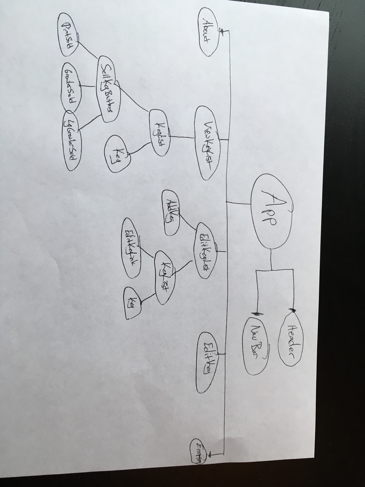
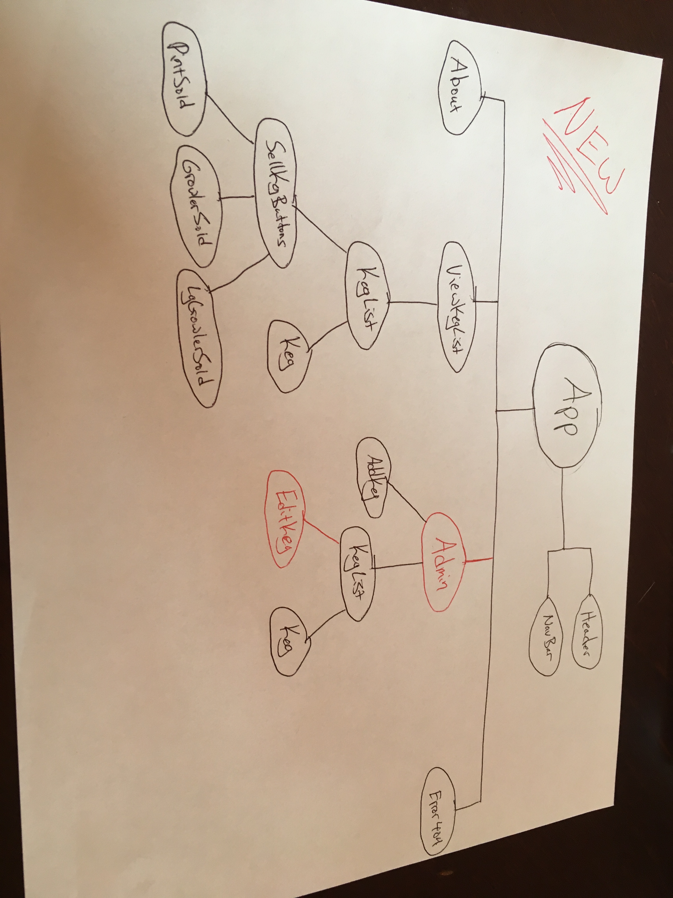

# Tap Room

### This application will keep track of what kinds of beer are available on tap and track the number of pints remaining in each keg

#### By Kevin Babcock

## Description

This website allows users to see what beers are available on tap, as well as where they were brewed, their price, and alcohol content. For employees, they can click a button to sell a pint, growler, or large growler. They can also edit keg information or add a new keg to the list.

## Photo

#Week 1:

#Week 2:

## Notes

* I'm not sure how to subtract the right amount from the kegs when a pint, growler, or large growler is sold, since all of these buttons are currently in their own components
* It seems odd that my EditKeg component is a child of my App component and not the EditKegList component, but I do not want to display the list of kegs in this view.
* I originally tried to make the keg list a parent of ViewKegsList and EditKegsList, since both were using it, but I found it easier to make this a child component of both ViewKegList and EditKegList and render the appropriate buttons depending on the url path.

##Known Bugs

* project is UI only, no back-end integration yet

## Setup/Installation Requirements

* Clone GitHub repository `https://github.com/kevinmbabcock/react-tap-room`
* run `npm install` in the root directory from the command line
* run `npm run start` when the install is finished
* navigate to `http://localhost:8080/` in the browser

## Support and contact details

Email: kevinmbabcock@icloud.com

## Technologies Used

* React
* JSX
* HTML
* CSS

## License

MIT
